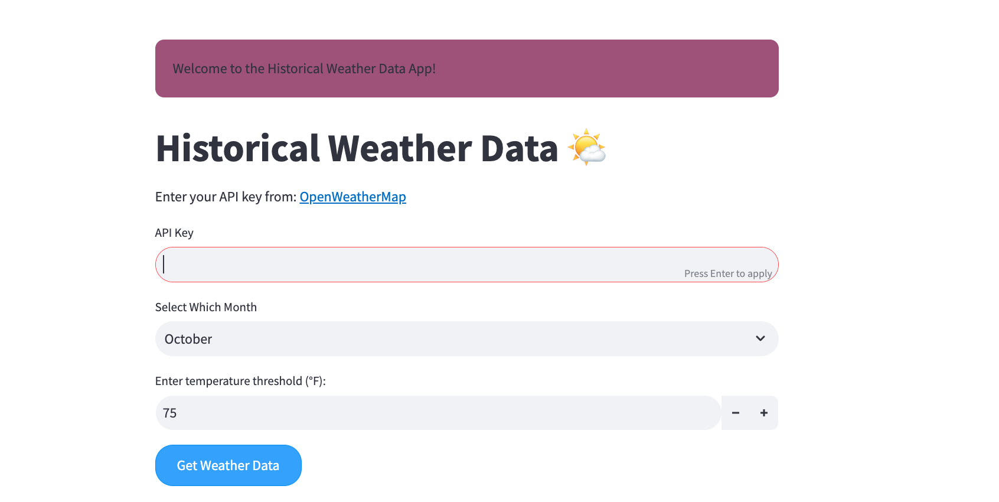
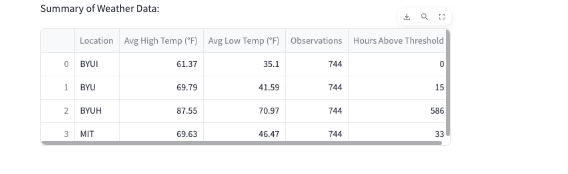
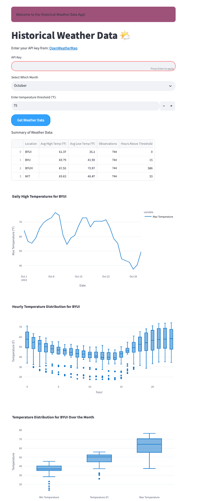

## Historical Weather Data App


## How to Start It

To get the application up and running on your system, please follow these steps:

1. **Install Docker:** Ensure Docker is installed on your machine. If it's not, visit [Docker's official website](https://www.docker.com/products/docker-desktop) and follow the installation guide for your operating system.

2. **Fork the Repository:** Navigate to the [GitHub repository](https://github.com/daviethedeveloper/app_challenge_wi24) and fork it. This will create a copy of the repository in your GitHub account.

3. **Clone Your Fork:** Clone the repository to your local machine.

4. **Start with a Docker Compose:** Navigate to the cloned repository's directory in your terminal, and start the application using Docker Compose:


   ```sh
      docker-compose up
   ```

5. **Debugging Tips for Mac Users**

If you encounter any path-related issues on a Mac, ensuring Docker's command-line tools are accessible might resolve them. Execute the following line in your terminal:

   ```sh
      export PATH="$PATH:/Applications/Docker.app/Contents/Resources/bin/"
   ```


## Introduction

With this app, users can input their API key, select a month, and choose a temperature threshold in Fahrenheit to retrieve historical weather data for locations like 'BYU', 'BYUI', and 'BYUH'.



### Sample Output

Below are examples of the data and the app interface you can expect:

- **Data Snapshot:**  
  

- **App Interface:**  
  


